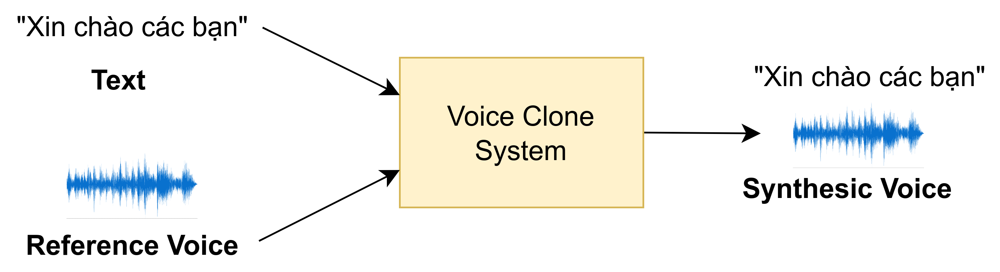
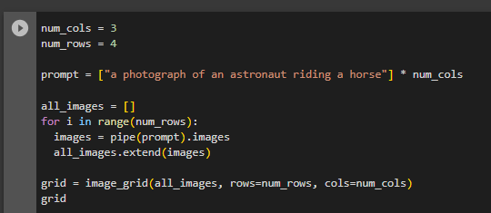
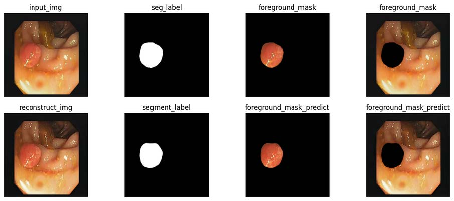

# Research

## Human–computer interaction

### Vietnamese Automatic Speech Recognition

  

Automatic Speech Recognition System

ASR Systems try to map each signal input to the corresponding text. The architecture of ASR Systems typically includes Feature Extractor, Acoustic Model (Encoder) and Decoder. In many situations, Language Model might be used to improve prediction accuracy. After being extracted by Feature Extractor, data are encoded by the Encoder and decoded by the Decoder to produce the text. Click <a href="https://asr-bilhfc3vqa-as.a.run.app/">here</a> for ASR demonstration.

### Voice Cloning

Voice cloning is a task in text-to-speech (TTS) technology that allows for replicating a person's voice to speak a given text. Voice cloning can be applied in various fields, such as creating voice agents for banks and commerce. It can restore the voices of deceased individuals or those with speech impairments. Additionally, it can be used to generate voices for characters in video games, enhancing the gaming experience with more personalized and realistic character interactions.

  

Voice Cloning System

Although there are several ongoing studies in this field, challenges remain. The generated voice often lacks the naturalness of human speech, and it may not capture the unique characteristics of the reference voice accurately. These limitations highlight the need for further advancements to achieve more realistic and distinctive voice cloning results.

  

DGSpeech Architecture

This project introduces DGSpeech, which is built on the FastSpeech2 architecture. DGSpeech incorporates:

- MixStyle Layer Normalization: this technique perturbs style information by mixing and shuffling style embeddings, enhancing robustness and generalization of TTS models to adapt to varying styles and domains.

- Flow-based Postnet: refines outputs from the transform decoder to produce more precise mel-spectrograms, enhancing the detail and quality of generated speech, particularly in expressive contexts.

Click [here](https://hungle45.github.io/tts-demo/) for Voice Cloning demonstration.

### Chatbot for restaurant booking service

Currently, the demand for direct interaction between businesses and customers is increasing. Science and technology is constantly evolving, Chatbot has been launched to solve the above needs for companies and businesses. Chatbots are used in many topics depending on the scenario built for bots. In the topic of restaurant booking service, the chatbot was created to interact with customers in the most natural way but still solve the customer's needs and get the most accurate information of the customer.

There are many frameworks for creating chatbots, one of which is the Rasa framework. The framework acts as the expected conversational flow which makes it feel more like a human interaction. This framework consists of two parts: Rasa NLU to determine user intent and Rasa Core based on user intent to decide a next action to be performed by the bot as the script is built.

  

Rasa NLU independent analysis system and independent action of Rasa Core <a href="https://rasa.com/blog/bending-the-ml-pipeline-in-rasa-3-0/">ref</a>

  

Test chatbot Rasa in fanpage facebook

### Emotion recognition
The problem of emotion recognition is a large area of research based on two subjects, which are emotional psychology and artificial intelligence. Human's emotions can be expressed through speech or nonverbal such as facial variations, tone of voice, etc and are recognized by sensor. In 1967, Mehrabian showed that 55% of emotions expressed from the face, 38% from the words voice and 7% from speech. That is why researchers are very interested in this field.  

Facial emotion recognition has many applications in variety of fields: 
- Education: learner's reactions to participating in the lesson.
- Examination: monitor and make predictions whenever contestants show signs of cheating.
- Marketing: how to receive information from buyers when listening about product offers.
- Security: helps detect suspicious behavior in the crowd and prevent threats potential opportunity.
- Medical: automate the care process and analyzing the mental health of users.
- Recruitment: evalutate candidate quality and interview process.

    

### Electrocardiogram (ECG) classification

  

ECG Signal

Early detection and prediction of cardiac anomalies play an important role in the diagnosis and treatment of cardiovascular diseases. In medicine, electrocardiography provides valuable information for the doctors since they can accurately determine what is happening concerning the heart activities. Nevertheless, electrocardiography classification is a non-trivial challenge due to the specialties of these data as well as the reliability of manual data collection methods. This motivates IASLab's members to study electrocardiography signal classification method based on Deep Learning approach to handle data collected from intelligent IoT devices.

### Image Captioning

In today's digital age, images have become the universal language of the internet. Image Captioning - this extraordinary fusion of computer vision and natural language processing has the capacity to bestow machines with the gift of language, enabling them to perceive and describe the intricate tapestry of our visual world in ways that were once the exclusive domain of human understanding.

  

Image Captioning

The mechanics of image captioning involve a two-fold process: Visual Recognition and Natural Language Generation.
+ First, state-of-the-art deep learning techniques, such as ***Convolutional Neural Networks (CNNs)***, are employed to extract nuanced features from an input image. These features encapsulate information about **shapes**, **objects**, **colors**, and **relationships** within the image.
+ Subsequently, ***Recurrent Neural Networks (RNNs)***, transformer models, or other advanced NLP techniques weave these features into coherent and contextually relevant textual descriptions.

  

Image Captioning - Basic Model

### Text-to-Image Generation

Our research team specializes in the exciting field of text-to-image generation. This technology has immense potential across various industries, including e-commerce, advertising, virtual reality, and creative content generation.

Datasets: MS-COCO, ANNA, Multi-modal CelebA-HQ, DeepFashion-MultiModal, ...

Key Features and Capabilities:

1. Advanced Text-to-Image Models: Our team has reproduced and analysis cutting-edge deep learning models that can generate visually coherent and contextually relevant images based on textual input. These models are trained on vast datasets and leverage advanced techniques such as attention mechanisms and generative adversarial networks (GANs) to produce stunning visual representations. Network architectures: DALL-E2, Stable Diffusion, ...
2. Fine-Grained Control: Our models allow fine-grained control over the generated images, enabling users to specify various attributes such as object appearance, background, lighting conditions, and more. This level of control empowers businesses to create custom visuals that align with their brand identity and specific requirements.
3. Scalability and Efficiency: Our research team focuses on developing scalable and efficient models that can handle large-scale text-to-image generation tasks. We optimize our solutions to balance computational resources while maintaining the quality and fidelity of the generated images, ensuring practical application in real-world scenarios.

Use Cases:

1. E-commerce: Generate product images based on textual descriptions, allowing for dynamic and customizable representations of products on e-commerce platforms.
2. Creative Content Generation: Enable artists, designers, and content creators to transform written ideas into vivid visual concepts, bringing stories, illustrations, and designs to life.
3. Virtual Reality and Gaming: Enhance virtual environments and gaming experiences by generating realistic scenes and characters based on textual input, enabling immersive storytelling and world-building.
4. Advertising and Marketing: Create compelling visual advertisements and marketing materials by generating images that accurately depict product features, brand messaging, and customer preferences.
5. Data Visualization: Transform textual data into meaningful visual representations, aiding in data analysis, decision-making, and communication of complex information.

  

  

### Automatic Slides Generator for Scientific Academic Papers

Presentations are commonly used in the fields of business, education, and research because they can effectively summarize and clarify large amounts of information using visual aids. With the development of deep learning, we aim to create a deep-learning model that can produce presentation slides on demand. This solution involves document summarizing, image and text retrieval, and slide organization to ensure that important components are presented in a suitable format. Our system is designed to help researchers efficiently create presentations on their respective topics.

Datasets: DOC2PPT, SciDuet, PS5K, ...

Key Features and Capabilities:

1. Convert a PDF paper to texts: Our system can convert scientific articles of any length from PDF format to text format by using the GROBID framework, thereby serving subsequent tasks.
2. Generate slides efficiently: Users enter the title of slides. Our system will generate slide contents that match these titles. Users can combine, and edit generated slides
3. Extract graphical elements exactly: Our system uses the pdffigures2 to extract figures and tables that are included in papers. The graphical elements is used in slide generation process.

Use Cases:

1. Researcher: Help the researchers can prepare the presentation quickly and creative.
2. Reader: Enable readers to capture the main idea of the papers.

  

  

### Other related topics
- NLP/NLU
- Speech: text-to-speech (TTS)
- Biomedical signal processing: EEG, ECG, etc.

### Other related topics
- NLP/NLU
- Speech: text-to-speech (TTS)
- Biomedical signal processing: EEG, ECG, etc.

## AI for Healthcare

### Tumor Segmentation

  

Lung Tumor Segmentation

  

Brain Tumor Segmentation

Nowadays, cancers is one of the most common causes of death. It is the growing of abnormal cells which is able to invade and destroy other cells and tissues; moreover, it can occur in any organ of the body. However, cancers can be treated if they're detected early. Therefore, some researches on this domain have been conducted by IASLab. We focus on detecting tumor of Lung and Brain.

Tumor Segmentation is the process of separating the tumor from a medical image (2D or 3D). It provides useful information for diagnosis, clinical studies and treatment planning. By using Deep Learining architectures, we got some promising results on both Lung and Brain tumor segmentation aims. This significantly encourages us to expand our jobs in Tumor Segmentation domain. 

<!-- - Lung cancer survival analysis
- etc. -->

### Medical image segmentation

Medical image segmentation, like a digital scalpel, unveils hidden details in scans to improve diagnoses, treatment, and patient care. While recent deep learning methods using Transformers and U-Net are powerful, they can be computationally expensive. Our MCUnet offers a solution, achieving high accuracy with efficient convolution operations. We introduce three key innovations: CRFBNet for improved skip connections, Multi-Head Output for better predictions, and Consistency Guide Loss for robust multi-head training.

  

Overall Architecture of MCUnet

  

Qualitative result

## Others

We always extend our research topic to meet our life needed, if you found a topic is interested, feel free to raise.

### Computer Vision
- Pattern recognition
- Object detection
- etc.

### Time series analysis
- VNPT 4G telecom maintenance
- etc.

